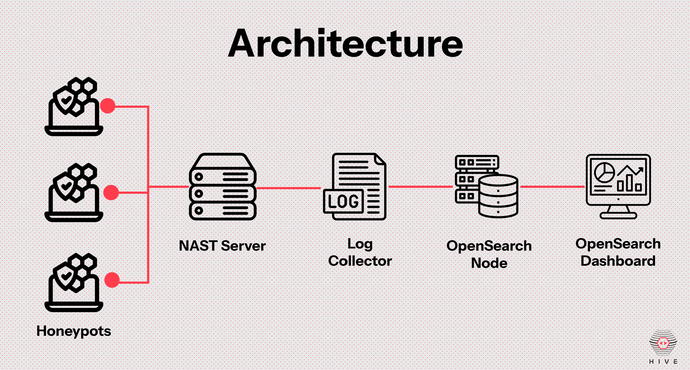

<p align="center">
  
</p>

# Project H.I.V.E (Honeypot Intrusion Vigilance Engine)

**An open-source, containerized honeypot intelligence platform** built for detecting, analyzing, and sharing real-world cyber threats. Project H.I.V.E empowers any organization big or small to gain visibility into malicious activity using intelligent and scalable honeypots.

## 🎯 Features

- 🚨 Multi-protocol honeypots (SSH, FTP, and HTTP)
- 📊 Log analysis using OpenSearch with visual dashboards
- 🧠 Machine learning anomaly detection
- 🔐 Rootless container architecture using Podman
- 🌍 Web-based interfaces
- 📥 Real-time log collection with NATS JetStream
- 🔒 Secure backend communication (API-free design)

## 🖼️ Screenshots

### 📊 OpenSearch Dashboard


### 🌐 Project H.I.V.E UI (Flask + Tailwind CSS)

#### 🖥️ Honeypot Management Page

-------------------------------

### 👷🏽‍♂️ Honeypot Builder Page

-------------------------------

### 🖥️ Service Management Page


## 🚀 Architecture

Project H.I.V.E follows a microservices-based architecture. Each component is containerized and communicates via a secure message broker (NATS) and OpenSearch API.



## ⚙️ Tech Stack

- 🐍 Python (Honeypots, NATS clients)
- 🐳 Podman (rootless containers)
- 📡 NATS + JetStream (message broker)
- 🔍 OpenSearch (log storage + dashboards)
- 🌐 Flask + Tailwind CSS (frontend)

## 📡 How It Works

1. Honeypots detect and log attacker sessions after authentication.
2. Logs are published to NATS (JetStream).
3. Log Collector container pulls logs and pushes them to OpenSearch.
4. The frontend queries OpenSearch for visualization.

## 🛠️ Installation

### 1. Clone the repo
```bash
git clone https://github.com/Shaveen-Balasooriya/Project-H.I.V.E.git
```

### 2. Install the service required
Project H.I.V.E requires Podman and Python. Please make sure to install those service based on your system. <br><br>
Install Podman: [Podman](https://podman.io/) (https://podman.io/)<br>
Install Python: [Python](https://www.python.org/) (https://www.python.org/)

### 3. Install the requirements
Install the all the required Python Packages Mentioned in the ```requirements.txt``` root folder.

### 4. Get the GeoLocation Database
Visit [MaxMind GeoIP® Databases](https://www.maxmind.com/en/geoip-databases) (https://www.maxmind.com/en/geoip-databases) and Download the ```GeoLite Country```	database that they provide.<br>

Add the database to the following file location<br>
```Project-HIVE-*\_internal\log_manager\log_collector```.

This is because the system will try to figure out the origins of attacker's IP address.

### 5. Start the service
Navigate to the Project-H.I.V.E and run the following based on the Operating System.<br><br>
<strong><u>Windows</u></strong>

```bash
.\Project-HIVE-Windows\Project-HIVE-Windows.exe
```
<br>
<strong><u>Linux</u></strong>

```bash
./Project-HIVE-Linux/Project-HIVE-Linux
```

### 6. OpenSearch Dashboard
OpenSearch provides an extensive dashboard that is highly customisable. It is very user friendly, for more information please refer to [OpenSearch Dashboard](https://docs.opensearch.org/docs/latest/dashboards/) (https://docs.opensearch.org/docs/latest/dashboards/). 

<b>Note</b>: A configuration file ```export.ndjson``` is provided in the root directory that can be used to load in a pre-made visualisations and a dashboard.

The OpenSearch Dashboard can be accessed via http://localhost:5601/ on the machine running the application. 

## 🤝 Contributions

Pull requests are welcome! For major changes, please open an issue first to discuss what you would like to change.

Want to help expand the dataset or improve analysis? Join the Project H.I.V.E community!
